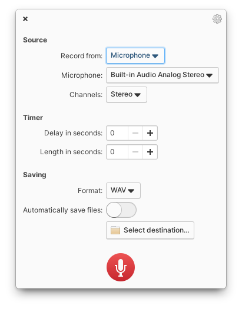
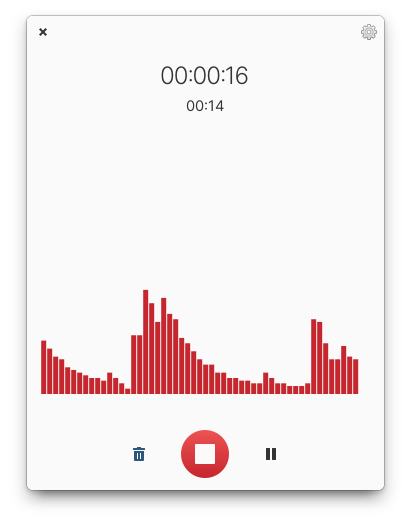

# Reco

Reco is an audio recorder focused on recording.

 

Features include:

* **Recording sounds from both your microphone and system at the same time.** This would be useful when you record conversations with chat apps or stream videos on the Internet
* **Saving in some commonly used formats.** It supports ALAC, FLAC, MP3, Ogg Vorbis, Opus, and WAV
* **Timed recording.** You can set a delay before recording up to 15 seconds, and the length of recording up to 600 seconds
* **Autosaving or always-ask-where-to-save workflow.** You can select whether the app saves recordings automatically or you choose a destination each time on saving them
* **Saving recording when the app quits.** Even if you happen to quit the app while recording, the recording is either saved automatically, or the file chooser dialog is shown - depending on your saving setting

## Installation

### For Users

On elementary OS? Click the button to get Reco on AppCenter:

[](https://appcenter.elementary.io/com.github.ryonakano.reco)

You can also download the app from Flathub, in case you're using another distribution.

[](https://flathub.org/apps/details/com.github.ryonakano.reco)

Community packages maintained by volunteers are also available on some distributions:

[](https://repology.org/project/reco/versions)

### For Developers

You'll need the following dependencies to build:

* libgee-0.8-dev
* libgranite-7-dev
* libgstreamer1.0-dev (>= 1.20)
* libgtk-4-dev (>= 4.10)
* [libryokucha](https://github.com/ryonakano/ryokucha)
    * automatically downloaded on build
* [livechart](https://github.com/lcallarec/live-chart) (commit `d364df43bd8336bf7ed461c57a28e97efa7115b1` or later)
    * automatically downloaded on build
* meson (>= 0.57.0)
* valac

You'll need the following dependencies to run:

* gstreamer1.0-libav (use the same version with libgstreamer1.0-dev)

Run `meson setup` to configure the build environment and run `ninja` to build

```bash
meson setup builddir --prefix=/usr
ninja -C builddir
```

To install, use `ninja install`, then execute with `com.github.ryonakano.reco`

```bash
ninja install -C builddir
com.github.ryonakano.reco
```

## Contributing

There are many ways you can contribute, even if you don't know how to code.

### Reporting Bugs or Suggesting Improvements

Simply [create a new issue](https://github.com/ryonakano/reco/issues/new) describing your problem and how to reproduce or your suggestion. If you are not used to do, [this section](https://docs.elementary.io/contributor-guide/feedback/reporting-issues) is for you.

### Writing Some Code

We follow [the coding style of elementary OS](https://docs.elementary.io/develop/writing-apps/code-style) and [its Human Interface Guidelines](https://docs.elementary.io/hig/). Try to respect them.

### Translation

We accept translations of this project through [Weblate](https://weblate.org/). We would appreciate it if you would join our translation work!

Click the following graphs to get started:

| App: Texts in the app itself | Metainfo: Texts in the desktop entry and the software center |
| --- | --- |
| [](https://hosted.weblate.org/projects/rosp/reco-app) | [](https://hosted.weblate.org/projects/rosp/reco-metainfo) |

## The Story Behind This App

This app is originally designed and released for elementary OS.

One day, I had to take minutes for a meeting in my department with my elementary laptop. The discussion was so fast-paced, though, that I couldn't listen and write down everything in the minutes. When I got home, I searched for a sound recorder app. I found some non-elementary apps like GNOME Sound Recorder, but there were none for elementary OS. Thus, I decided to create one designed for elementary OS.
